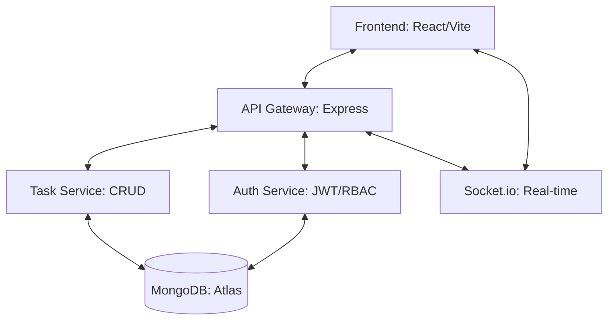

# Technical Documentation - AutoBiz SaaS

AutoBiz is an enterprise-grade business automation platform designed for scalability, security, and premium user experience.

## 🏗 Architecture Overview

The project follows **Clean Architecture** and **SOLID** principles to ensure maintainability and testability.



### Backend (Node.js/Express + TypeScript)
- **Controller-Service-Model Pattern**: 
  - **Routes**: Define endpoints and apply middleware.
  - **Controllers**: Handle HTTP requests/responses and delegate logic to services.
  - **Services**: Contain business logic and interact with models.
  - **Models**: Mongoose schemas defining the data structure.
- **Middleware Layer**:
  - `auth.ts`: Handles JWT verification and RBAC.
  - `error.ts`: Centralized error handling.
  - `rateLimit`: Protects against brute-force attacks.

### Frontend (React + TypeScript)
- **Feature-based Structure**: Components are organized by feature (Auth, Dashboard, Tasks).
- **Atomic Components**: Reusable UI elements (Buttons, Inputs, Cards).
- **State Management**:
  - **Zustand**: Global client-side state (Auth, UI preferences).
  - **React Query**: Server-side state (Data fetching, caching, synchronization).
- **Design System**: 
  - Tailwind CSS with a custom theme (shadcn-inspired).
  - Framer Motion for micro-animations and layout transitions.

---

## 🗄 Database Schema (MongoDB)

### User Model
| Field | Type | Description |
|---|---|---|
| `name` | String | Full name of the user |
| `email` | String | Unique email address |
| `password` | String | Bcrypt hashed password |
| `role` | Enum | admin, manager, employee, customer |
| `isVerified` | Boolean | Email verification status |
| `refreshToken` | String | Token for session rotation |

### Task Model
| Field | Type | Description |
|---|---|---|
| `title` | String | Task title |
| `description` | String | Detailed task description |
| `status` | Enum | pending, in-progress, completed, blocked |
| `priority` | Enum | low, medium, high |
| `assignedTo` | ObjectId | Reference to User model |
| `createdBy` | ObjectId | Reference to User model |
| `dueDate` | Date | Completion deadline |

---

## 🔐 Security Implementation

- **Authentication**: JWT-based with Refresh Token rotation for secure long-lived sessions.
- **RBAC**: Permission checks at the route and controller level.
- **Data Protection**:
  - **Helmet**: Secures HTTP headers.
  - **CORS**: Restricted to approved origins.
  - **Bcrypt**: Password hashing with 10 salt rounds.
  - **Input Validation**: Handled via Zod schemas (implemented in controllers).

---

## 📡 API Documentation

Interactive API documentation is available via Swagger at `/api-docs`.

### Key Endpoints
- `POST /api/auth/register`: Create a new account.
- `POST /api/auth/login`: Authenticate and receive tokens.
- `GET /api/auth/me`: Get current user profile.
- `GET /api/tasks`: List user-relevant tasks.
- `POST /api/tasks`: Create a new workflow task.

---

## 🚀 Deployment & DevOps

### Docker Orchestration
The app is fully containerized.
- **Backend**: Node:22-alpine image.
- **Frontend**: Multi-stage build with Nginx for production serving.
- **MongoDB**: Standard mongo image with persistent volumes.

### CI/CD Pipeline
- **GitHub Actions**: 
  - Automatically runs backend tests on every PR.
  - Validates frontend builds.
  - Checks Docker image builds.

---

## 🧪 Testing Strategy

- **Unit/Integration Tests**: Using Jest and Supertest.
- **Coverage**: Core API endpoints and health checks are covered.
- **Manual QA**: Verified responsive layouts and real-time notification flows.

---

## 📂 Project Structure

```text
.
├── frontend/
│   ├── src/
│   │   ├── components/
│   │   ├── hooks/
│   │   ├── pages/
│   │   ├── services/
│   │   └── store/
│   ├── Dockerfile
│   ├── nginx.conf
│   └── vite.config.ts
├── backend/
│   ├── src/
│   │   ├── config/
│   │   ├── controllers/
│   │   ├── middleware/
│   │   ├── models/
│   │   ├── routes/
│   │   └── services/
│   ├── tests/
│   ├── Dockerfile
│   └── jest.config.js
├── shared/
├── docker-compose.yml
└── README.md
```
